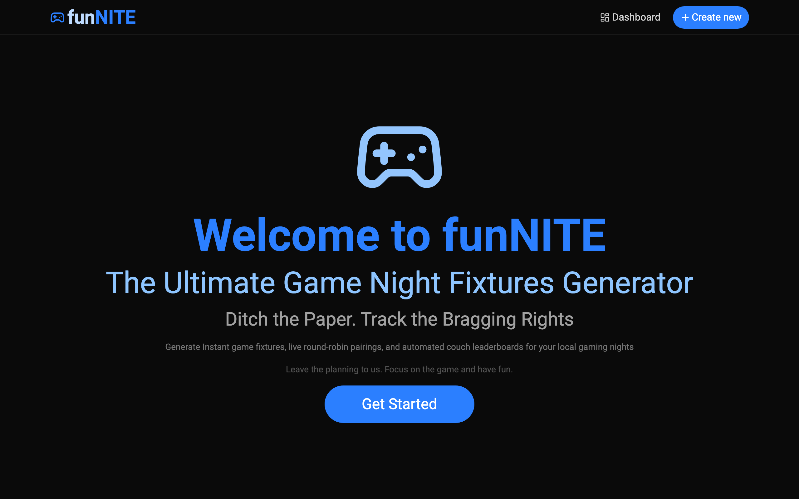
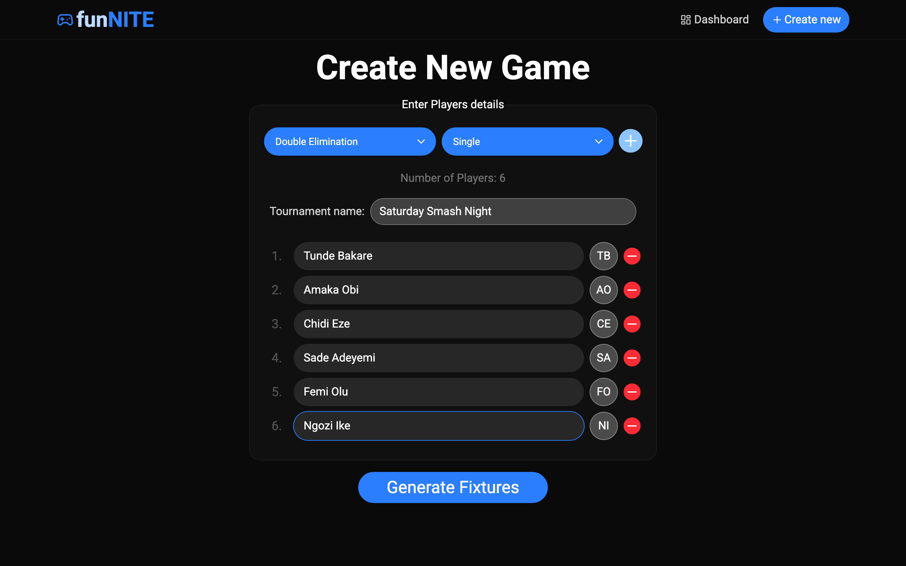
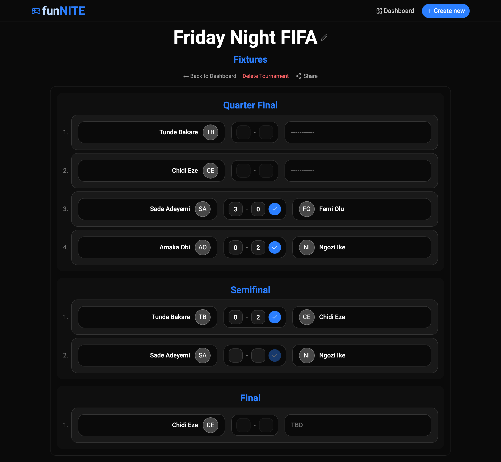
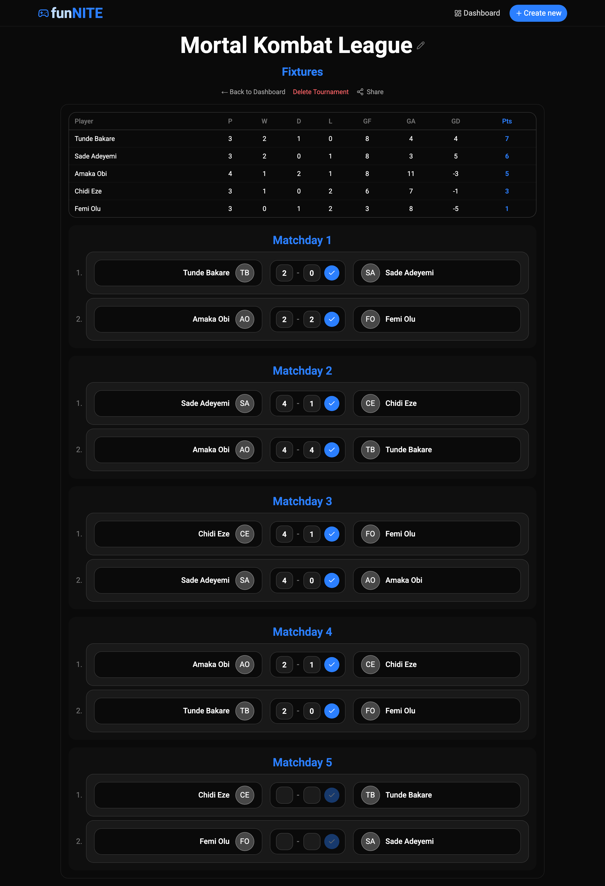
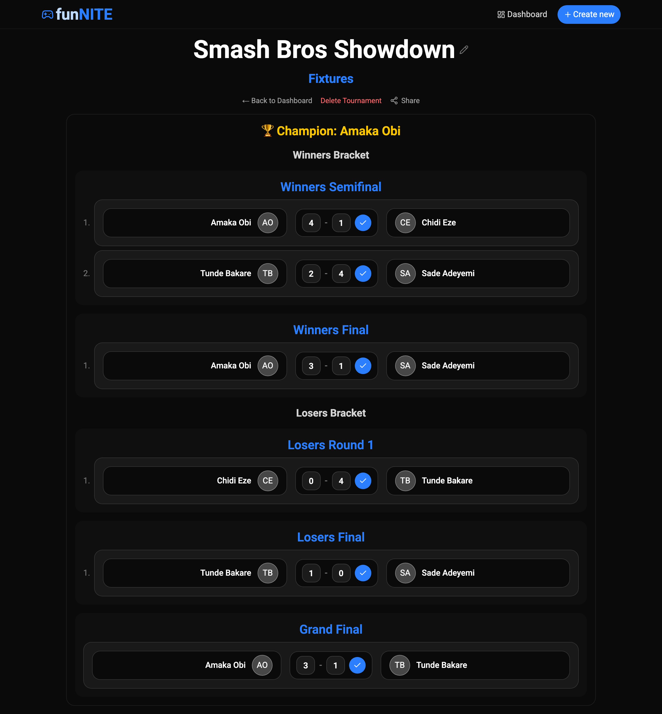
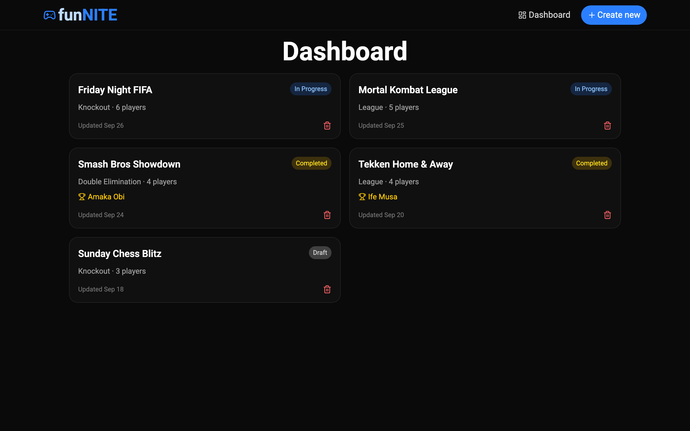
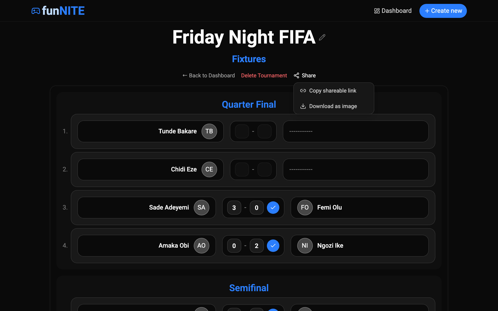
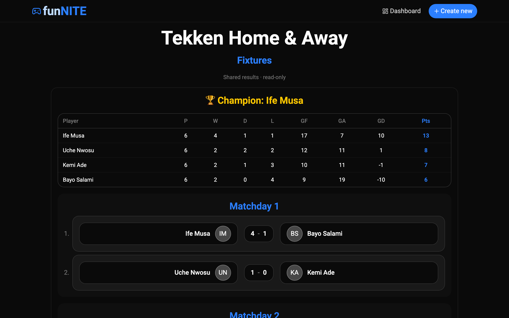
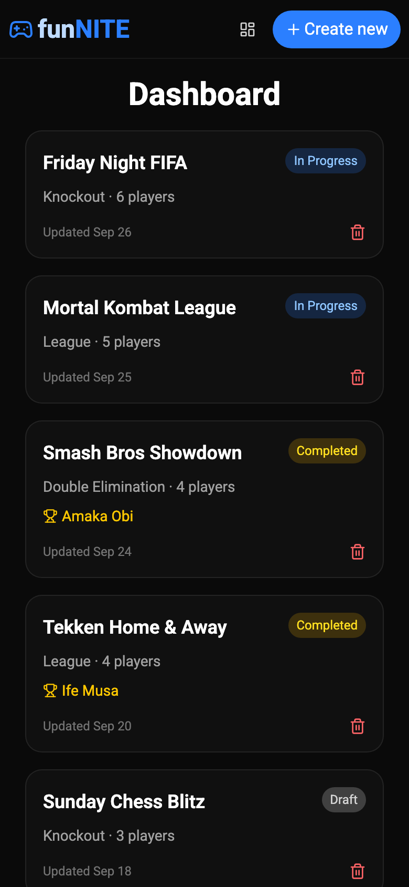
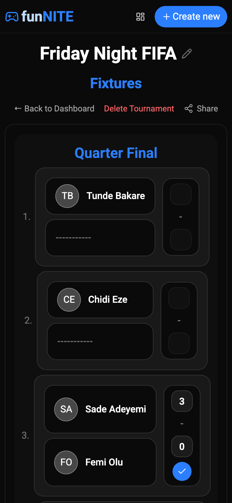

<div align="center">

# 🎮 funNITE

**Ditch the paper. Track the bragging rights.**

A fixtures generator and scoreboard for local gaming nights: FIFA, Tekken, Smash, chess, or anything else your group plays.
Add your players, pick a format, and funNITE draws the fixtures, advances winners, keeps the league table up to date, and crowns a champion.



</div>

---

## Table of contents

- [Features](#features)
- [Screenshots](#screenshots)
- [Tournament formats](#tournament-formats)
- [Getting started](#getting-started)
- [Available scripts](#available-scripts)
- [Tech stack](#tech-stack)
- [Project structure](#project-structure)
- [How it works](#how-it-works)
- [Roadmap ideas](#roadmap-ideas)
- [License](#license)

---

## Features

- **Three tournament formats**: Knockout, Double Elimination, and League (round-robin).
- **Single or Home & Away**: in a league, players can meet once or twice, with home and away reversed in the second leg.
- **Automatic seeding and byes**: players are shuffled at random, and when the player count isn't a power of two, byes are added and advanced for you.
- **Winners advance automatically**: enter a score, and the winner moves on to the next round (and in double elimination, the loser drops into the losers bracket).
- **Live league table**: standings (P / W / D / L / GF / GA / GD / Pts) are recalculated after every result.
- **Champion detection**: the winner appears as soon as the final (or last league match) is played.
- **Dashboard**: every tournament is saved with a status badge (Draft, In Progress or Completed) and its champion.
- **Share results**: copy a read-only link that anyone can open, or download the results as a PNG image.
- **Editable tournament names**: rename a tournament from the fixtures page.
- **No account or backend**: everything is stored in your browser's `localStorage`.
- **Responsive and animated**: works on phones and desktops, with smooth transitions powered by Motion.

---

## Screenshots

### Create a tournament

Choose a format and mode, name your tournament, and add as many players as you like (minimum 3). Each player gets an avatar from their initials.



### Knockout fixtures

Byes show as `-----------` and advance automatically. Matches that are waiting on an earlier result show **TBD**. Ties aren't allowed in elimination formats.



### League with live standings

The table sorts by points, then goal difference, then goals scored, then name. Draws are allowed.



### Double elimination

A player is out only after losing twice. The page shows the winners bracket, the losers bracket, and a grand final. If the losers-bracket champion wins the grand final, a **bracket reset** match decides the title.



### Dashboard

All your tournaments in one place, sorted by last update. Click a card to continue where you left off: drafts open the create form, and started tournaments open their fixtures.



### Share and download

From any fixtures page, copy a shareable link or download the results as an image.



Anyone with the link sees a **read-only** view of the tournament. No login or shared database needed.



### Mobile

<p align="center">
  
  &nbsp;&nbsp;
  
</p>

---

## Tournament formats

| Format | How it works | Ties allowed? | Champion |
| --- | --- | --- | --- |
| **Knockout** | Single-elimination bracket. The bracket is padded to the next power of two, and byes go to randomly chosen players. | No | Winner of the Final |
| **Double Elimination** | Winners bracket and losers bracket. Losing in the winners bracket drops you into the losers bracket; a second loss knocks you out. The two bracket champions meet in the Grand Final, with a bracket reset if the losers-bracket champion wins the first game. | No | Winner of the Grand Final (or the reset) |
| **League** | Round-robin using the circle method. Every player meets every other player once (**Single**) or twice with home and away swapped (**Home & Away**). Odd player counts give one player a rest each matchday. | Yes | Top of the table once every match is played |

**Points (League):** Win = 3, Draw = 1, Loss = 0.

---

## Getting started

### Prerequisites

- [Node.js](https://nodejs.org/) 20.19+ or 22.12+ (required by Vite 8)
- npm

### Installation

```bash
# Clone the repository
git clone https://github.com/kaywizzy123/funNITE.git
cd funNITE

# Install dependencies
npm install

# Start the dev server
npm run dev
```

Then open the URL Vite prints (usually <http://localhost:5173>).

### Quick walkthrough

1. Click **Get Started** or **Create new**.
2. Pick a format (**Knockout**, **Double Elimination**, or **League**) and a mode (**Single** or **Home & Away**).
3. Enter a tournament name and your players' names. Use **+** to add players and **−** to remove them.
4. Click **Generate Fixtures**.
5. Enter each match's score and press ✓. Winners advance and standings update automatically.
6. Use **Share** to copy a link or download an image of the results.
7. Return to your tournaments at any time from the **Dashboard**.

---

## Available scripts

| Command | Description |
| --- | --- |
| `npm run dev` | Start the Vite dev server with hot reload |
| `npm run build` | Build a production bundle into `dist/` |
| `npm run preview` | Serve the production build locally |
| `npm run lint` | Run ESLint on the project |

---

## Tech stack

- [React 19](https://react.dev/): UI
- [Vite 8](https://vite.dev/): dev server and build tool
- [React Router 7](https://reactrouter.com/): client-side routing
- [Tailwind CSS 4](https://tailwindcss.com/): styling
- [Motion](https://motion.dev/): animations
- [Lucide React](https://lucide.dev/): icons
- [html-to-image](https://github.com/bubkoo/html-to-image): "Download as image"

---

## Project structure

```
src/
├── App.jsx                   # Routes + layout
├── main.jsx                  # Entry point (BrowserRouter)
├── context/
│   └── AppContext.jsx        # Global state, autosave, match-result handlers
├── pages/
│   ├── Home.jsx              # Landing page
│   ├── Create.jsx            # Tournament setup form
│   ├── Fixtures.jsx          # Fixtures, score entry, standings, sharing
│   ├── Dashboard.jsx         # Saved tournaments list
│   └── SharedView.jsx        # Read-only view from a share link
├── components/
│   ├── Navbar.jsx
│   ├── PlayerDetails.jsx     # One player row on the create form
│   ├── FixtureCard.jsx       # Match card with score inputs
│   ├── StandingsTable.jsx    # League table
│   ├── ShareMenu.jsx         # Copy link / download PNG
│   └── DeleteConfirmModal.jsx
└── utils/
    ├── bracket.js            # Knockout bracket generation + advancement
    ├── doubleElim.js         # Losers bracket, drop-downs, grand final
    ├── roundRobin.js         # League fixtures (circle method)
    ├── standings.js          # League table calculation
    ├── tournamentStatus.js   # Draft / in progress / completed + champion
    ├── shareEncode.js        # Encode/decode tournaments into share URLs
    ├── storage.js            # localStorage persistence (+ legacy migration)
    ├── matchHelpers.js       # shuffle() and createMatch()
    └── motionVariants.js     # Shared animation variants
```

### Routes

| Path | Page |
| --- | --- |
| `/` | Home |
| `/create` | Create or edit a draft tournament |
| `/fixtures` | Fixtures for the current tournament |
| `/dashboard` | All saved tournaments |
| `/share/:encoded` | Read-only shared results |

---

## How it works

### Persistence

State lives in `AppContext`. When fixtures are generated for the first time, the tournament gets an ID, and after that every change is autosaved to `localStorage`:

- `funnite:tournaments`: array of all saved tournaments
- `funnite:currentTournamentId`: the tournament to reopen on refresh
- `funnite:newTournamentDraft`: a half-filled Create form, so a refresh doesn't lose it (cleared once fixtures are generated)

Because data is stored in the browser, tournaments are tied to one device and browser. Clearing site data deletes them.

### Share links

Share links need no backend. The tournament's name, format, mode, and results are serialized to JSON and **base64url-encoded into the URL** (`/share/<encoded>`). `SharedView` decodes the data and renders it read-only. Large tournaments produce long URLs.

> **Deploying?** Because the app uses client-side routing, set up your host to serve `index.html` for all paths (an SPA fallback). Without it, share links and page refreshes on routes like `/dashboard` will return a 404.

### Brackets

- **Knockout:** players are shuffled, the bracket is padded to the next power of two, and bye winners are placed into round 2 straight away. The winner of match `i` goes to match `⌊i/2⌋` in the next round.
- **Double elimination:** the losers bracket alternates between rounds where survivors play each other and "drop" rounds where they meet fresh losers from the winners bracket. Byes cascade through automatically. The grand final is set once both bracket champions are known.

---

## Roadmap ideas

- Seeded (non-random) draws
- Visual bracket tree view
- Player stats across tournaments
- Cloud sync / accounts
- Export fixtures to CSV

---

## License

This project is licensed under the [MIT License](LICENSE).

---

<div align="center">
Made for game nights 🕹️
</div>
